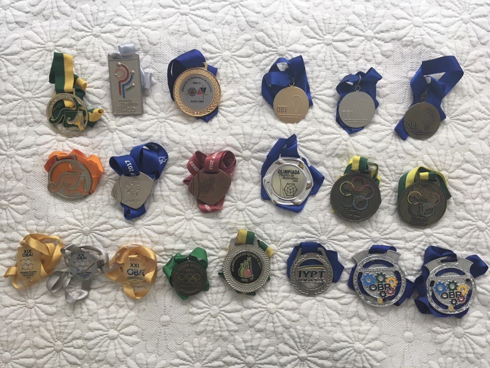
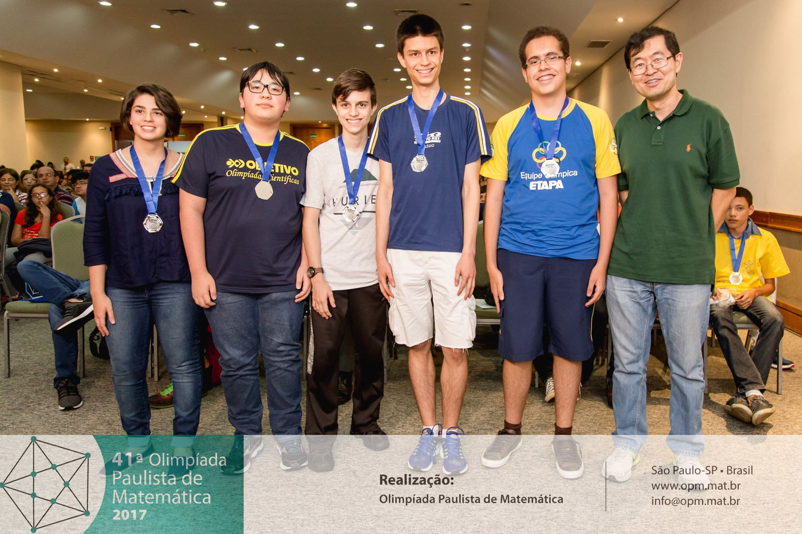

# Certificados Olímpicos

Esse repositório possui certificados de premiações em olimpíadas do conhecimento.

São ao todo 5 medalhas de ouro:

- Olimpíada Brasileira de Informática 2018 Modalidade Programação Nível 2
- Olimpíada Brasileira de Astronomia 2016 e 2018
- Olimpíada de Matemática da Unicamp 2018
- Concurso Canguru Sem Fronteiras 2018 Nível S

8 medalhas de prata:

- Olimpíada Brasileira de Informática 2016 Modalidade Programação Nível 1
- Olimpíada Paulista de Matemática 2017
- Olimpíada Paulista de Física 2017
- Olimpíada Paulista de Química 2017
- Olimpíada Brasileira de Matemática das Escolas Públicas OBMEP 2017
- Concurso Canguru Sem Fronteiras 2017 Nível J
- Olimpíada Brasileira de Astronomia 2017
- IYPT Brasil 2018

5 medalhas de bronze:

- Olimpíada Brasileira de Informática 2017 (Modalidade Programação Nível 2) e 2019 (Modalidade Programação Nível Universitário)
- Olimpíada Brasileira de Matemática das Escolas Públicas OBMEP 2018
- Competição Elon Lages Lima de Matemática 2020
- Olimpíada Brasileira de Química 2017

e 6 menções honrosas:

- Olimpíada de Matemática da Unicamp 2016
- Olimpíada Brasileira de Física 2016 e 2017
- Torneio Virtual de Química 2017
- Olimpíada Nacional de Ciências 2018
- Olimpíada Brasileira de Matemática 2020 Nível Universitário

